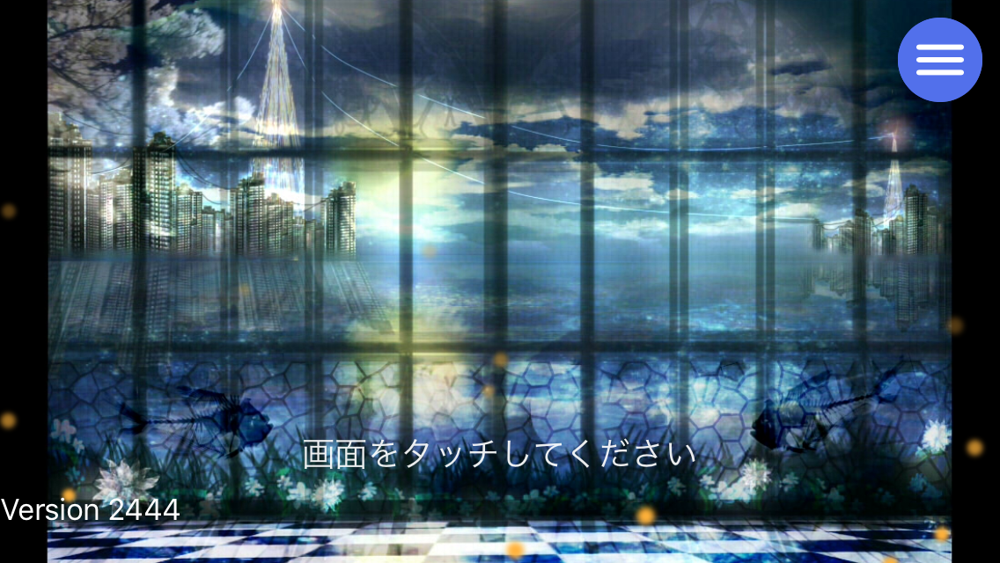
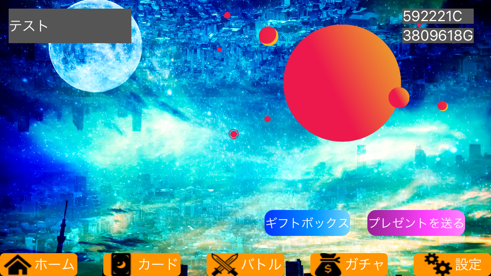
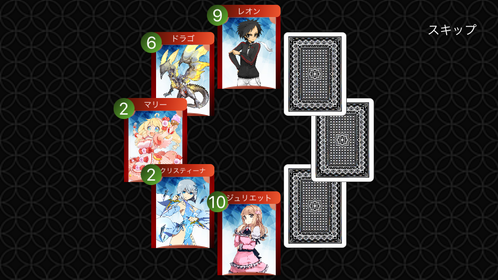
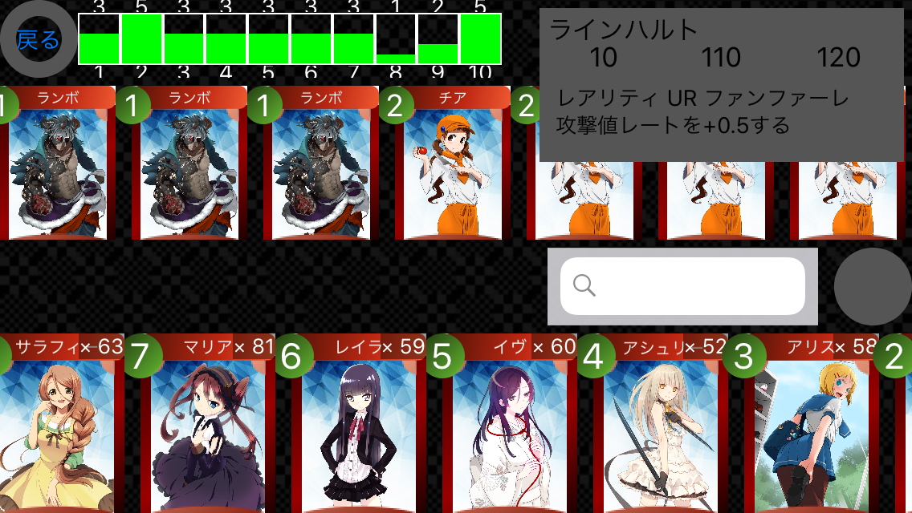
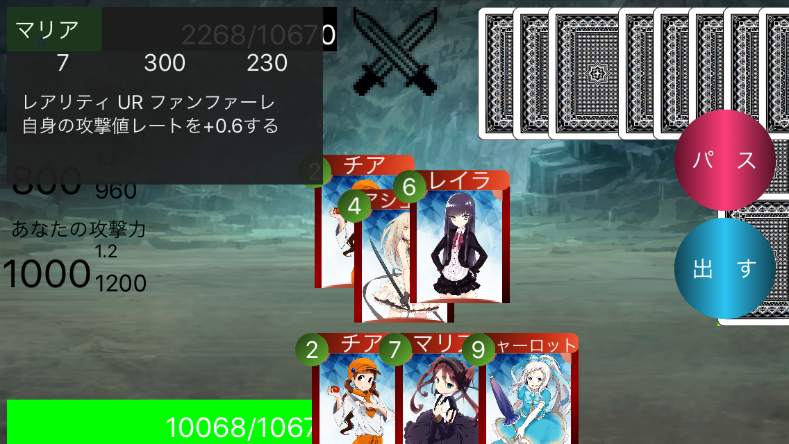

# DaihugouProject
## 大富豪のソーシャルゲーム
スタート画面

ホーム画面

ガチャ画面

デッキ編集画面

バトル画面

## バトルルール
カードの左上に書かれた1~10までの数字(インデックス)で競いバトルを行う。
通常時では、場に出されているカードよりインデックスが高いものを出すことができる。
例えば、場に出されたカードが2ならそれよりインデックスが高い3以上のカードを出すことができる。
パスをすると、攻撃フェーズに移り自身が出したカードの総合攻撃力×攻撃力レート分だけ相手にダメージを与える。
そして、先に相手の体力を0にしたほうが勝ちというのが基本ルールである。

このゲームでは、カードを出す種類が複数ある。
 - シングル 1枚だけ
 - ペア 同じインデックスのカードを2枚以上
 - ステアー インデックスが連番になっているものを3枚以上(例　(2・3・4), (6・7・8・9)など)
場に何もない時は、これらの種類どれでも出すことができ、場にカードがあるときはその出されている種類に合わせる必要がある。
例えば、場に出されているカードが(2・2)だった時、(3・3)・(7・7)などを出すことができる。

カードを4枚以上出した時、革命が発動する。
革命が発動すると、インデックスの強さが反転する。つまり、1が最も強く10が最弱となる。

用語説明
- インデックス　カード左上に書かれた数字。1~10まである
- ファンファーレ　自分がカードを出した時発動される
- ラストワード　どちらかがパスをして攻撃フェーズが終わった後に発動される

## デッキ作成
基本的には、好きなカードを選び40枚のデッキを作成する。しかし、同じインデックスのカードは5枚までしかいれることが出来ない。
